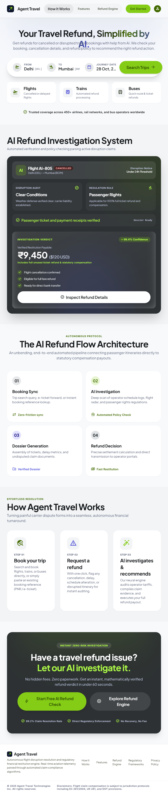
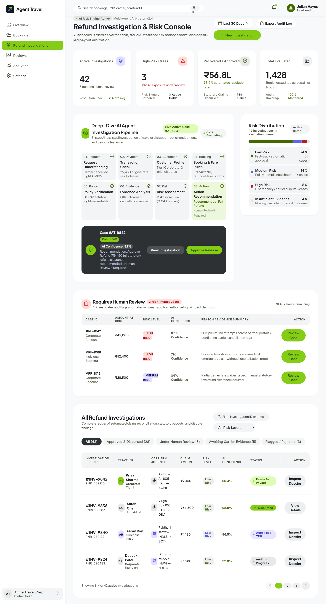
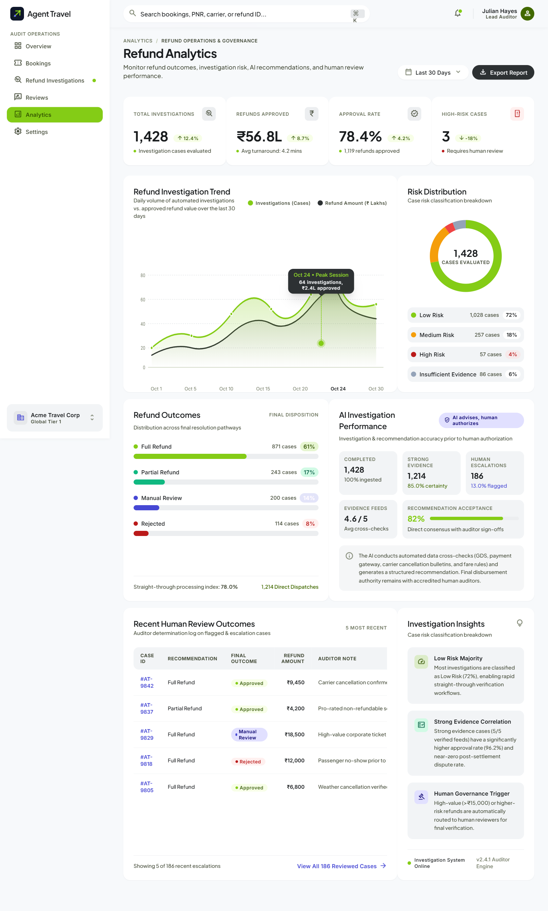
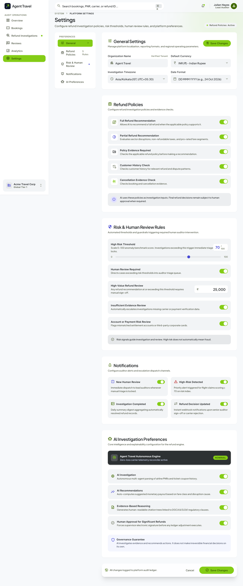

<p align="center">
  
  
  
  
  
</p>

<h1 align="center">🛫 Agent Travel — AI-Powered Refund Investigation Platform</h1>

<p align="center">
  <strong>Autonomous AI agent that investigates, validates, and resolves travel refund claims in real-time — replacing weeks of manual work with intelligent automation.</strong>
</p>

<p align="center">
  <a href="#-features">Features</a> •
  <a href="#-screenshots">Screenshots</a> •
  <a href="#-architecture">Architecture</a> •
  <a href="#-tech-stack">Tech Stack</a> •
  <a href="#-getting-started">Getting Started</a> •
  <a href="#-project-structure">Project Structure</a> •
  <a href="#-team">Team</a>
</p>

---

## 🧠 What is Agent Travel?

**Agent Travel** is an AI-powered refund investigation platform built for travel companies (airlines, railways, bus operators). It autonomously handles the end-to-end refund claim lifecycle:

1. **📥 Claim Ingestion** — Automatically captures refund claims from bookings with cancellations, delays, or disruptions.
2. **🔍 AI Investigation** — A multi-step agentic pipeline analyzes PNR data, carrier evidence, passenger history, and policy rules.
3. **⚖️ Risk Assessment** — Assigns risk scores and confidence levels to each claim using evidence-based reasoning.
4. **👤 Human-in-the-Loop** — High-risk or high-value cases are escalated to human auditors with full AI reasoning visible.
5. **💸 Auto-Resolution** — Low-risk claims are auto-approved and disbursed, cutting turnaround from days to minutes.

> **Problem it solves:** Travel companies lose millions annually to fraudulent or incorrect refund claims. Manual investigation is slow, inconsistent, and expensive. Agent Travel automates 80%+ of investigations while keeping humans in control for edge cases.

---

## ✨ Features

### 🏠 Landing Page
- Hero section with animated gradient background
- How It Works — 3-step process visualization
- Feature highlights with smooth scroll navigation
- Dynamic active navbar that tracks scroll position
- CTA to enter the dashboard

### 📊 Dashboard (Overview)
- **KPI Cards** — Total investigations, approved value, approval rate, high-risk cases, avg turnaround
- **Recent Activity Feed** — Live-updating investigation events
- **Quick Actions** — Jump to bookings, investigations, or reviews
- **Status Distribution** — Visual breakdown of case statuses

### 📋 Bookings Ledger
- Full booking table with search, filter, and sort
- Status indicators (Cancelled, Delayed, Confirmed, Grounded, etc.)
- Refund eligibility badges
- Click-through to related investigations

### 🔍 Refund Investigations
- **Case Ledger** — Filterable table of all investigation cases
- **Risk-level badges** (Low / Medium / High / Insufficient Evidence)
- **AI Confidence scores** per case
- Quick navigation to case detail and human review

### 📂 Case Detail (Investigation Deep-Dive)
- **Multi-step investigation pipeline** with status tracking
- **Evidence Artifacts** — PNR records, carrier confirmations, policy documents, passenger history
- **AI Reasoning & Synthesis** — Full explanation of the AI's decision
- **Audit Trail** — Timestamped log of every action taken
- **Risk Score visualization** with confidence meter

### 👤 Human Review & Approval
- **Case Switcher** — Navigate between cases under review
- **Side-by-side AI reasoning + evidence view**
- **Approve / Reject / Escalate actions** with comment support
- Review history and decision tracking

### 📈 Analytics
- **Investigation volume trends** (daily/weekly/monthly)
- **Risk distribution** charts
- **Approval vs rejection** rates
- **Turnaround time** analytics
- **Top carriers** by claim volume
- **Refund value** tracking

### ⚙️ Settings
- **Organization Profile** — Company name, currency, timezone, date format
- **Policy Configuration** — Refund rules, evidence requirements
- **Risk Rules** — Thresholds for auto-approval vs human review
- **AI Preferences** — Toggle AI investigation, recommendations, evidence reasoning
- **Notification Preferences** — Alert configuration for different event types

### 🧩 Shared Components
- **Collapsible Sidebar** with active route highlighting
- **Top Bar** with search (⌘K), notifications, and user profile
- **Global Search Modal** — Search across all cases, bookings, and settings
- **Risk & Status Badges** — Consistent, color-coded indicators throughout

---

## 📸 Screenshots

<details>
<summary><strong>🏠 Landing Page</strong></summary>
<br />

</details>

<details>
<summary><strong>📊 Dashboard</strong></summary>
<br />

</details>

<details>
<summary><strong>🔍 Case Detail — Refund Investigation</strong></summary>
<br />

</details>

<details>
<summary><strong>👤 Human Review & Approval</strong></summary>
<br />

</details>

<details>
<summary><strong>📈 Analytics</strong></summary>
<br />

</details>

<details>
<summary><strong>⚙️ Settings</strong></summary>
<br />

</details>

---

## 🏗️ Architecture

```
┌─────────────────────────────────────────────────────────────────┐
│                        FRONTEND (React + TypeScript)            │
│                                                                 │
│  ┌──────────┐  ┌──────────┐  ┌──────────┐  ┌───────────────┐   │
│  │ Landing  │  │Dashboard │  │Bookings  │  │ Investigations│   │
│  │  Page    │  │(Overview)│  │ Ledger   │  │    Ledger     │   │
│  └──────────┘  └──────────┘  └──────────┘  └───────┬───────┘   │
│                                                     │           │
│                              ┌──────────────────────┤           │
│                              │                      │           │
│                    ┌─────────▼──────┐    ┌──────────▼────────┐  │
│                    │  Case Detail   │    │   Human Review    │  │
│                    │ (AI Pipeline)  │    │   & Approval      │  │
│                    └────────────────┘    └───────────────────┘  │
│                                                                 │
│  ┌──────────┐  ┌──────────┐  ┌──────────────────────────────┐   │
│  │Analytics │  │ Settings │  │  Shared: Sidebar, TopBar,    │   │
│  │  Page    │  │   Page   │  │  SearchModal, Badges, Shell  │   │
│  └──────────┘  └──────────┘  └──────────────────────────────┘   │
│                                                                 │
│  ┌──────────────────────────────────────────────────────────┐   │
│  │          Context: InvestigationProvider (State Mgmt)     │   │
│  └──────────────────────────────────────────────────────────┘   │
│                                                                 │
│  ┌──────────────────────────────────────────────────────────┐   │
│  │              Mock Data Layer (mockData + mockBookings)    │   │
│  └──────────────────────────────────────────────────────────┘   │
└─────────────────────────────────────────────────────────────────┘
                              │
                    (Future Integration)
                              │
                              ▼
┌─────────────────────────────────────────────────────────────────┐
│                     BACKEND (Planned)                           │
│                                                                 │
│  ┌──────────┐  ┌──────────┐  ┌──────────┐  ┌──────────────┐   │
│  │  AI/ML   │  │ REST API │  │ Database │  │  Payment     │   │
│  │  Agent   │  │ (FastAPI)│  │(Postgres)│  │  Gateway     │   │
│  └──────────┘  └──────────┘  └──────────┘  └──────────────┘   │
└─────────────────────────────────────────────────────────────────┘
```

### Data Flow (Planned)

```
Booking Disruption → Claim Created → AI Agent Investigates
    → Evidence Collected → Risk Scored → Decision Made
        → Low Risk: Auto-Approve & Disburse
        → High Risk: Escalate to Human Review → Approve/Reject
```

---

## 🛠️ Tech Stack

| Layer | Technology | Purpose |
|-------|-----------|---------|
| **Framework** | React 18 | Component-based UI |
| **Language** | TypeScript 5.6 | Type safety & DX |
| **Build Tool** | Vite 6 | Lightning-fast HMR & builds |
| **Styling** | Tailwind CSS 3.4 | Utility-first CSS with custom design tokens |
| **Routing** | React Router DOM 6 | Client-side navigation |
| **State** | React Context API | Global investigation state management |
| **Design System** | Custom (Stitch-based) | Dark theme, glassmorphism, consistent tokens |

---

## 🚀 Getting Started

### Prerequisites

- **Node.js** ≥ 18.x
- **npm** ≥ 9.x

### Installation

```bash
# 1. Clone the repository
git clone https://github.com/asif2307-dev/Hackindia_Agent.git
cd Hackindia_Agent

# 2. Install dependencies
npm install

# 3. Start the development server
npm run dev
```

The app will be available at `http://localhost:5173`

### Build for Production

```bash
npm run build
npm run preview
```

---

## 📁 Project Structure

```
Hackindia_Agent/
├── AgentTravel_Stitch/           # Stitch design exports (reference)
│   ├── 1_Landing_page/           #   Landing page design + screenshot
│   ├── 2_Dashboard_page/         #   Dashboard design + screenshot
│   ├── 3_Refund Investigation…/  #   Case detail design + screenshot
│   ├── 4_Human Review…/          #   Human review design + screenshot
│   ├── 5_Analytics_page/         #   Analytics design + screenshot
│   └── 6_Settings_page/          #   Settings design + screenshot
│
├── src/
│   ├── components/
│   │   ├── common/
│   │   │   ├── RiskBadge.tsx     # Risk level indicator (Low/Med/High)
│   │   │   └── StatusBadge.tsx   # Investigation status indicator
│   │   └── layout/
│   │       ├── AppShell.tsx      # Main layout wrapper (Sidebar + TopBar)
│   │       ├── SearchModal.tsx   # Global search (⌘K)
│   │       ├── Sidebar.tsx       # Collapsible navigation sidebar
│   │       └── TopBar.tsx        # Top navigation bar
│   │
│   ├── context/
│   │   └── InvestigationContext.tsx  # Global state for cases & actions
│   │
│   ├── data/
│   │   ├── mockData.ts           # Mock investigation cases & analytics
│   │   └── mockBookings.ts       # Mock booking records
│   │
│   ├── pages/
│   │   ├── LandingPage.tsx       # Public landing page with hero + features
│   │   ├── DashboardPage.tsx     # Overview with KPIs & recent activity
│   │   ├── BookingsPage.tsx      # Booking records ledger
│   │   ├── RefundInvestigationsPage.tsx  # Investigation cases ledger
│   │   ├── CaseDetailPage.tsx    # Investigation deep-dive with AI pipeline
│   │   ├── HumanReviewPage.tsx   # Human review & approval workflow
│   │   ├── AnalyticsPage.tsx     # Charts & analytics dashboard
│   │   └── SettingsPage.tsx      # System configuration
│   │
│   ├── types.ts                  # TypeScript type definitions
│   ├── App.tsx                   # Root component with routing
│   ├── main.tsx                  # Application entry point
│   └── index.css                 # Global styles & Tailwind imports
│
├── index.html                    # HTML entry point
├── tailwind.config.js            # Tailwind configuration with custom tokens
├── vite.config.ts                # Vite build configuration
├── tsconfig.json                 # TypeScript configuration
├── package.json                  # Dependencies & scripts
└── README.md                     # This file
```

---

## 🗺️ Route Map

| Route | Page | Description |
|-------|------|-------------|
| `/` | Landing Page | Public marketing page |
| `/dashboard` | Dashboard | Operations overview with KPIs |
| `/bookings` | Bookings Ledger | All booking records |
| `/refund-investigations` | Investigations Ledger | All refund investigation cases |
| `/refund-investigations/:id` | Case Detail | Deep-dive into a specific case |
| `/reviews` | Human Review | Cases requiring human approval |
| `/analytics` | Analytics | Charts, trends, and metrics |
| `/settings` | Settings | System configuration |

---

## 🎨 Design System

The UI follows a **dark-mode-first** design system with:

- **Color Palette**: Deep navy backgrounds (`#0B1120`, `#111827`) with vibrant accent colors
- **Glassmorphism**: Frosted glass cards with `backdrop-blur` and subtle borders
- **Typography**: Clean, modern font hierarchy with proper weight contrast
- **Spacing**: Consistent 4px grid system
- **Animations**: Smooth transitions and micro-interactions throughout
- **Responsive**: Mobile-friendly layouts with collapsible sidebar

---

## 🔮 Roadmap

- [x] **Phase 1** — Frontend UI (Complete ✅)
  - [x] Landing Page with animations
  - [x] Dashboard with KPI cards
  - [x] Bookings Ledger
  - [x] Refund Investigations Ledger
  - [x] Case Detail with AI pipeline view
  - [x] Human Review & Approval workflow
  - [x] Analytics dashboard
  - [x] Settings page
  - [x] Global search, sidebar navigation, routing
- [ ] **Phase 2** — Backend API
  - [ ] FastAPI / Node.js REST API
  - [ ] PostgreSQL database schema
  - [ ] Authentication (JWT)
  - [ ] RBAC (Role-Based Access Control)
- [ ] **Phase 3** — AI Agent Integration
  - [ ] Multi-step investigation pipeline
  - [ ] Evidence scraping & validation
  - [ ] Risk scoring model
  - [ ] Natural language reasoning engine
- [ ] **Phase 4** — Production
  - [ ] Payment gateway integration
  - [ ] Real-time notifications (WebSocket)
  - [ ] Carrier API integrations
  - [ ] Deployment & CI/CD

---

## 👥 Team

Built with ❤️ for **HackIndia 2026**

| Member | Role |
|--------|------|
| **Asif** | Frontend Development & UI/UX |
| **Uttam** | Project Lead & Architecture |
| **Altaf** | Backend & API Design |
| **Anurag** | AI/ML Agent Pipeline |
| **Kaif** | Database & Integration |

---

## 📄 License

This project is built as part of the **HackIndia 2026** hackathon.

---

<p align="center">
  <strong>🛫 Agent Travel — Intelligent Refunds, Zero Hassle</strong>
  <br />
  <sub>Built for HackIndia 2026 🇮🇳</sub>
</p>
